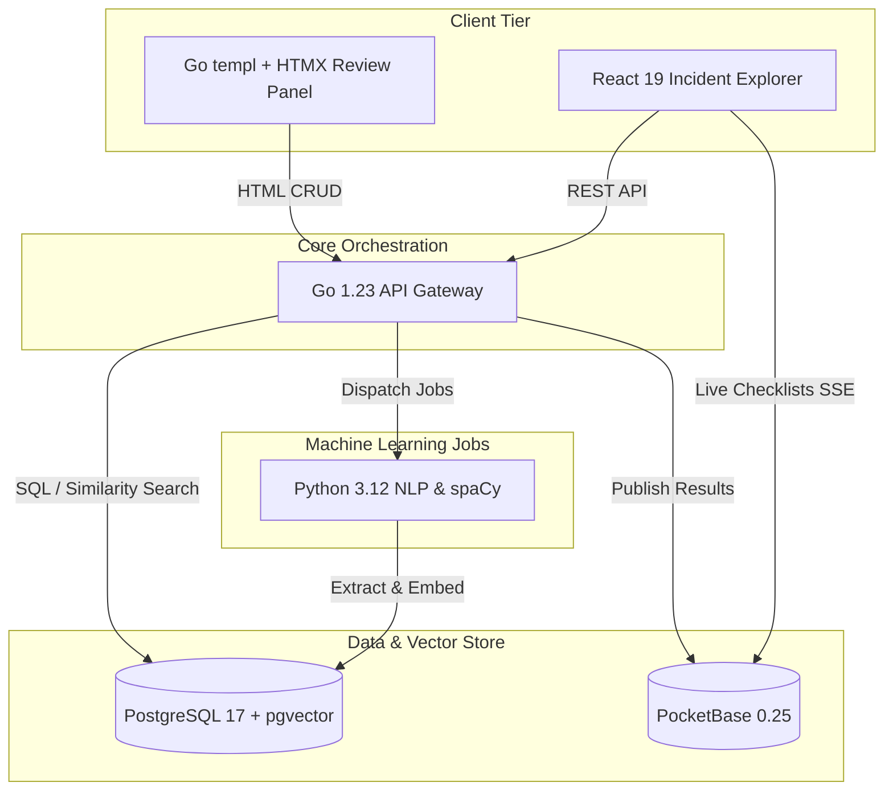

# 🔬 tm3l-postmortem-machine

> **Feed it incident reports and it extracts the failure patterns so you can check if YOU'RE vulnerable to the same thing.**

[](LICENSE)
[](server/go.mod)
[](jobs/pyproject.toml)
[](explorer/package.json)

---

## 📖 Table of Contents
1. [Overview](#-overview)
2. [Architecture](#-architecture)
3. [Tech Stack](#-tech-stack)
4. [Getting Started](#-getting-started)
5. [Documentation](#-documentation)

---

## 🌟 Overview
Incident intelligence platform that parses unstructured public postmortems using NLP. It extracts failure cascades, generates vector embeddings to cluster similar architectural weaknesses, and outputs actionable "Am I Vulnerable?" audit checklists.

## 📊 Architecture



## 🛠 Tech Stack
- **API Orchestrator**: Go 1.23 + `templ` + `HTMX`
- **NLP Engine**: Python 3.12 + `uv` + `spaCy`
- **Incident Explorer**: React 19 + TypeScript + Vite 6
- **Databases**: PostgreSQL 17 (`pgvector`) + PocketBase 0.25 (Edge/Real-time)

## 🚀 Getting Started
```bash
git clone https://github.com/tm3l/tm3l-postmortem-machine.git
cd tm3l-postmortem-machine
make docker-up
```
Visit `http://localhost:5175` to view the incident explorer.

## 📚 Documentation
See [`docs/architecture.md`](docs/architecture.md) for detailed internals.
